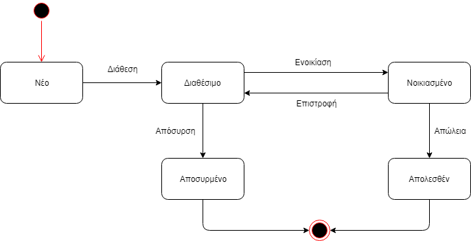

# Εισαγωγή
Το CarRentalApp είναι μια εφαρμογή ενοικίασης αυτοκινήτων που απευθύνεται κυρίως σε μικρομεσαίες και τοπικές επιχειρήσεις ενοικιαζόμενων αυτοκινήτων που δεν έχουν μεγάλη απήχηση και πρόσβαση σε ευρύ κοινό.
Το παρόν έγγραφο περιλαμβάνει πληροφορίες για το CarRentalApp όπως:
 - Λειτουργικότητα της εφαρμογής
 - Ποίοι και με ποιό τρόπο θα αλληλεπιδρούν με την εφαρμογή
 - Περιπτώσεις χρήσεις της εφαρμογής
 - Προδιαγραφές που τηρεί η εφαρμογή
 - Βασικοί επιχειρησιακοί κανόνες που ακολουθεί η επιχειρησή-πάροχος της εφαρμογής προκειμένου να εξασφαλίσει την εύρυθμη λειτουργία της.

## Εμβέλεια

***Η εφαρμογή ενοικίασης οχημάτων θα παρέχει λειτουργικότητα για:***

 - Την δημιουργία λογαριασμών των επιχειρήσεων που νοικιάζουν τα οχήματά τους μέσω της εφαρμογής.
 - Την καταγραφή των στοιχείων των επιχειρήσεων.
 - Την καταγραφή των οχημάτων των επιχειρήσεων.
 - Την επεξεργασία των οχημάτων των επιχειρήσεων από τις ίδιες.
 - Την πληρωμή των επιχειρήσεων μέσω της εφαρμογής.
 - Την παροχή στατιστικών αναφορών αυτόματα κάθε μήνα από την εφαρμογή.
 - Την παροχή συμβουλών αυτόματα κάθε 6 μήνες από την εφαρμογή.
 - Την επεξεργασία αιτημάτων ενοικίασης από την επιχείρηση εντός 8 ωρών.
 - Την χρήση ταυτοποίησης για την σύνδεση σε λογαριασμό.
 - Την αναζήτηση οχημάτων από τον πελάτη με βάσει των προτιμήσεών του.
 - Την ολοκλήρωση της πληρωμής από τη μεριά του πελάτη για την ενοικίαση.
 - Την αποστολή ενημερωτικού ηλεκτρονικού μηνύματος στον πελάτη με τα στοιχεία της κράτησης και την απόδειξη πληρωμής.
 - Την αποστολή αίτησης ενοικίασης προς την επιχείρηση.

***Η εφαρμογή ενοικίασης οχημάτων δεν θα παρέχει λειτουργικότητα για:***

 - Την αυτόματη ενημέρωση των καταστάσεων των οχημάτων που διαθέτει η κάθε επιχείρηση.
 - Την δημιουργία λογαριασμών τύπου πελάτη.

## Ορισμοί ακρώνυμα και συντομογραφίες

| Έννοια | Επεξήγηση |
|----------|---------|
| Επιχείρηση | Η επιχείρηση είναι το νομικό πρόσωπο το οποίο επιθυμεί να πουλήσει τις υπηρεσίες της ( ενοικίαση οχημάτων) μέσω της εφαρμογής. |
| Υπάλληλος | Ο υπάλληλος είναι εργαζόμενος της επιχείρησης και διαχειρίζεται τον λογαριασμό της στην εφαρμογή για εκείνη. Εκείνος είναι ο υπεύθυνος επεξεργασίας των στοιχείων της, των οχημάτων της και των αιτήσεών της. |
| Πολιτική | Αναφέρεται στην πολιτική της επιχείρησης και εξηγεί τον τρόπο που με τον οποίο λειτουργεί η επιχείρηση και τους περιορισμούς που θέτει. |
| Όχημα | Το όχημα είναι το αντικείμενο που είναι διαθέσιμο προς ενοικίαση από την κάθε επιχείρηση. Κάθε επιχείρηση μπορεί να διαθέτει διαφορετικά οχήματα και διαφορετικό πλήθος για το κάθε ένα. Το όχημα προσδιορίζεται από κάποια χαρακτηριστικά (μάρκα, τύπος, κατηγορία, κυβικά, θέσεις κλπ.).|
| Αίτηση ενοικίασης | Η αίτηση περιέχει όλα τα στοιχεία που χρειάζεται η επιχείρηση για να προχωρήσει στην ενοικίαση του οχήματος. Ενδεικτικά τα στοιχεία αυτά είναι το ονοματεπώνυμο του πελάτη, το όχημα που έχει επιλεγεί, η περιοχή και οι ημερομηνίες ενοικίασης. |

## Αναφορές

#### [Πίνακας περιπτώσεων χρήσης](requirements.md)

## Επισκόπηση

\[*Γράφουμε πως οργανώνεται το υπόλοιπο έγγραφο*\]
- [Συνολική περιγραφή](#Συνολική-περιγραφή)
- [Περιπτώσεις Χρήσης](#Περιπτώσεις-Χρήσης)
- [Υποστηρικτικό υλικό](#Υποστηρικτικό-υλικό)
# Συνολική περιγραφή

## Επισκόπηση μοντέλου περιπτώσεων χρήσης

## Υποθέσεις και εξαρτήσεις

\[*Γράφουμε τις υποθέσεις που κάνουμε και τις εξαρτήσεις του συστήματος σε σχέση με το περιβάλλον του.*\]

# Ειδικές Απαιτήσεις 

## Περιπτώσεις χρήσης

### Οι ενδιαφερόμενοι και οι ανάγκες τους

| Ενδιαφερόμενοι | Ανάγκες |
|----------------|---------|
| Υπάλληλος | Θέλει να μπορεί να δημιουργεί λογαριασμό για την επιχείρηση στην οποία εργάζεται είτε να συνδέεται σε αυτόν μετά την δημιουργία του, να επεξεργάζεται τα στοιχέια της και την πολιτική της. Θέλει να προσθέτει νέα οχήματα στο κατάλογο του λογαριασμού της επιχείρησης και να επεξεργάζεται τα στοιχεία ακόμη και των προηγούμενων. Θέλει να συνδέεται στην εφαρμογή. Θέλει να έχει πρόσβαση στα αιτήματα που δέχεται η επιχείρηση για ενοικίαση και να μπορεί να απορρίπτει κάποιο εντός 8 ωρών για κάποιο σημαντικό λόγο. Θέλει να λαμβάνει στατιστική ενημέρωση για την πορεία της επιχείρησης μέσα στην εφαρμογή. Θέλει να λαμβάνει συμβουλές για το πως να αυξήσει τις πωλήσεις της και να βελτιώσει την παρουσία της στην εφαρμογή.|
| Πελάτης | Θέλει να μπορεί να νοικιάσει όχημα μέσω της εφαρμογής, αναζητώντας οχήματα βάσει των προτιμήσεών του και να ολοκληρώνει την διαδικασία μέσα στην εφαρμογή γρήγορα.|

### Actors του συστήματος

| Actor | Περιγραφή | Στόχοι | Ενδιαφερόμενοι|
|-------|-----------|--------|---------------|
| Υπάλληλος| Ο υπάλληλος είναι εργαζόμενος της επιχείρησης και διαχειρίζεται τον λογαριασμό της στην εφαρμογή για εκείνη. Εκείνος είναι ο υπεύθυνος επεξεργασίας των στοιχείων της, των οχημάτων της και των αιτήσεών της. | Διαχείρηση λογαριασμού, διαχείρηση οχημάτων, διαχείρηση αιτήσεων. | Υπάλληλος |
| Ημερολόγιο συστήματος | Το ημερολόγιο συστήματος εξάγει στατιστικά και συμβουλές τα οποία τα στέλνει με μορφή αναφοράς στην επιχείρηση. | Η ενημέρωση της επιχείρησης και η βελτίωση της μέσω της εφαρμογής | Υπάλληλος|
| Πελάτης | Ο πελάτης είναι ο χρήστης της εφαρμογής που επιθυμεί να  νοικιάσει ένα όχημα, αναζητώντας το και ολοκληρώνοντας την διαδικασία της ενοικίασης και της πληρωμής μέσω της εφαρμογής. | Η γρήγορη εύρεση ενός οχήματος προς ενοικίαση και η εύκολη πληρωμή.| Πελάτης|

### Περιγραφές περιπτώσεων χρήσης

#### [ΠΧ1 Διαχείριση στοιχείων λογαριασμού επιχείρησης](uc1-account-management.md)

#### [ΠΧ2 Διαχείριση στοιχείων οχημάτων](uc2-vehicle-management.md)

#### [ΠΧ3 Ταυτοποίηση](uc3-identification.md)

#### [ΠΧ4 Διαχείριση αιτημάτων ενοικίασης](uc4-request-management.md)

#### [ΠΧ5 Εξαγωγή στατιστικών](uc5-export-statistics.md)

#### [ΠΧ6 Παροχή συμβουλών](uc6-advising.md)

#### [ΠΧ7 Δημιουργία αίτησης ενοικίασης οχήματος](uc7-renting-request.md)

## Συμπληρωματικές προδιαγραφές

### Απαιτήσεις διεπαφών

#### Διεπαφές χρήστη
- Όλες οι διεπαφές χρήστη θα είναι μέσω της εφαρμογής.
- Κάθε όψη της εφαρμογής θα συνοδεύεται από κουμπί βοήθειας που θα επεξηγεί την όψη και τις λειτουργίες της στον χρήστη.
- Η σχεδίαση της εφαρμογης ακολουθεί τα πλαίσια σχεδιασμού του **Android Material Design**. Για περισσότερες πληροφορίες πατήστε [εδώ](https://developer.android.com/design).

#### Διεπαφές υλικού
- Το λογισμικό δεν επικοινωνεί με άλλες συσκευές.

#### Διεπαφές επικοινωνίας
- Το σύστημα θα στέλνει ενημερωτικό ηλεκτρονικό μήνυμα στον πελάτη με όλες τις πληροφορίες της κράτησής του και στην επιχείρηση το ηλεκτρονικό μήνυμα που θα την ειδοποιεί ότι έχει λάβει μια νέα αίτηση ενοικίασης.

#### Διεπαφές λογισμικού
- Για την αποστολή των ηλεκτρονικών μηνυμάτων το λογισμικό θα επικοινωνεί με τον διακομιστή της "εταιρίας" μας(Τοπική μνήμη). 

### Περιορισμοί σχεδίασης και υλοποίησης
- Βάση δεδομένων: Τοπική μνήμη
- Java: Android 5.0 Lollipop +

### Ποιοτικά χαρακτηριστικά

#### Απόδοση

Η ταχύτητα του συστήματος θα πρέπει να είναι ανεκτή από κάθε χρήστη και να μην επηρεάζει την λειτουργία του. Θα χρησιμοποιούνται κατάλληλες δομές δεδομένων και αλγόριθμοι για να επιτευχθεί αυτός ο σκοπός.

#### Διαθεσιμότητα

Το σύστημα θα πρέπει α είναι διαθέσιμο για όλες του τις λειτουργίες συνέχεια. Το σύστημα θα είναι χωρισμένο κατάλληλα σε τμήματα έτσι ώστε αν δεν μπορεί να εκτελεστεί ένα κομμάτι του να μην επηρεάζεται η διαθεσιμότητα κάποιου άλλου μη άμεσα συνδεδεμένου.

#### Ασφάλεια

Το σύστημα θα χρησιμοποιεί κρυπτογραφία. Θα αποθηκεύει τους κωδικούς σε hashing μορφή. Επίσης θα παρέχουμε σε κάθε χρήστη πρόσβαση μόνο στα δεδομένα που του είναι απαραίτητα για να εκτελέσει τον ρόλο του.

#### Ευελιξία

Το σύστημα θα μπορεί να τρέχει σε συστήματα από **Android 5.0 Lollipop και άνω(92.8% συσκευών)**.

#### Ευχρηστία

Η εφαρμογή δεν θα απαιτεί εκπαίδευση για την χρήση της, λόγω του **λιτού** σχεδιασμού της.

# Υποστηρικτικό υλικό

## Μοντέλο πεδίου

## Ανάλυση περιπτώσεων χρήσης
--------------------------

### Κλάσεις ανάλυσης

### Συμπεριφορές

\[*Για κάθε σημαντική περίπτωση χρήσης εισάγουμε ένα διάγραμμα κλάσεων με τις κλάσεις που συμμετέχουν στη συμπεριφορά του συστήματος για την περίπτωση χρήσης. Το σημαντικότερο όμως είναι ένα διάγραμμα επικοινωνίας ή ακολουθίας που δείχνει την ανταλλαγή μηνυμάτων.*

*Βλέπε το παράδειγμα 4-16 στη σελίδα 262 του βιβλίου*\]

#### Άνοιγμα νέου λογαριασμού

## Άλλα μοντέλα
------------
*Παρουσιάζεται το διαγραμμα μηχανής καταστάσεων για το όχημα.*

## Επιχειρησιακοί κανόνες

| Επιχειρησιακοί κανόνες | Περιγραφή |
| :----------------------| :---------|
| ΕΚ1 | O πελάτης θα πρέπει να έχει συμπληρώσει το 18ο έτος της ηλικίας του και να κατέχει δίπλωμα για το όχημα που πρόκειται να νοικιάσει.|
| ΕΚ2 | Η επιχείρηση θα μπορεί να απορρίψει αίτηση μόνο εντός 8 ωρών από την ώρα υποβολής της.|
| ΕΚ3 | Η επιχείρηση θα μπορεί να λαμβάνει στατιστικές αναφορές μόνο αν έχει λογαριασμό για διάστημα μεγαλύτερο του ενός μήνα.|
| ΕΚ4 | Η επιχείρηση θα μπορεί να λαμβάνει συμβουλές μόνο αν έχει λογαριασμό για διάστημα μεγαλύτερο των έξι μηνών. |
| ΕΚ5 | Η περιοχή παραλαβής του οχήματος είναι και η περιοχή παράδοσής του κατά την επιστροφή του. |
