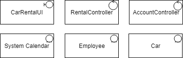

# Εισαγωγή

## Εμβέλεια

***Η εφαρμογή ενοικίασης οχημάτων θα παρέχει λειτουργικότητα για:***

 - Την δημιουργία λογαριασμών των επιχειρήσεων που νοικιάζουν τα οχήματά τους μέσω της εφαρμογής.
 - Την καταγραφή των στοιχείων των επιχειρήσεων.
 - Την καταγραφή των οχημάτων των επιχειρήσεων.
 - Την επεξεργασία των οχημάτων των επιχειρήσεων από τις ίδιες.
 - Την πληρωμή των επιχειρήσεων μέσω της εφαρμογής.
 - Την παροχή στατιστικών αναφορών αυτόματα κάθε μήνα από την εφαρμογή.
 - Την παροχή συμβουλών αυτόματα κάθε 6 μήνες από την εφαρμογή.
 - Την επεξεργασία αιτημάτων ενοικίασης από την επιχείρηση εντός 8 ωρών.
 - Την χρήση ταυτοποίησης για την σύνδεση σε λογαριασμό.
 - Την αναζήτηση οχημάτων από τον πελάτη με βάσει των προτιμήσεών του.
 - Την ολοκλήρωση της πληρωμής από τη μεριά του πελάτη για την ενοικίαση.
 - Την αποστολή ενημερωτικού ηλεκτρονικού μηνύματος στον πελάτη με τα στοιχεία της κράτησης και την απόδειξη πληρωμής.
 - Την αποστολή αίτησης ενοικίασης προς την επιχείρηση.

***Η εφαρμογή ενοικίασης οχημάτων δεν θα παρέχει λειτουργικότητα για:***

 - Την αυτόματη ενημέρωση των καταστάσεων των οχημάτων που διαθέτει η κάθε επιχείρηση.
 - Την δημιουργία λογαριασμών τύπου πελάτη.

## Ορισμοί ακρώνυμα και συντομογραφίες

| Έννοια | Επεξήγηση |
|----------|---------|
| Επιχείρηση | Η επιχείρηση είναι το νομικό πρόσωπο το οποίο επιθυμεί να πουλήσει τις υπηρεσίες της ( ενοικίαση οχημάτων) μέσω της εφαρμογής. |
| Υπάλληλος | Ο υπάλληλος είναι εργαζόμενος της επιχείρησης και διαχειρίζεται τον λογαριασμό της στην εφαρμογή για εκείνη. Εκείνος είναι ο υπεύθυνος επεξεργασίας των στοιχείων της, των οχημάτων της και των αιτήσεών της. |
| Πολιτική | Αναφέρεται στην πολιτική της επιχείρησης και εξηγεί τον τρόπο που με τον οποίο λειτουργεί η επιχείρηση και τους περιορισμούς που θέτει. |
| Όχημα | Το όχημα είναι το αντικείμενο που είναι διαθέσιμο προς ενοικίαση από την κάθε επιχείρηση. Κάθε επιχείρηση μπορεί να διαθέτει διαφορετικά οχήματα και διαφορετικό πλήθος για το κάθε ένα. Το όχημα προσδιορίζεται από κάποια χαρακτηριστικά (μάρκα, τύπος, κατηγορία, κυβικά, θέσεις κλπ.).|
| Αίτηση ενοικίασης | Η αίτηση περιέχει όλα τα στοιχεία που χρειάζεται η επιχείρηση για να προχωρήσει στην ενοικίαση του οχήματος. Ενδεικτικά τα στοιχεία αυτά είναι το ονοματεπώνυμο του πελάτη, το όχημα που έχει επιλεγεί, η περιοχή και οι ημερομηνίες ενοικίασης. |

## Αναφορές

#### [Πίνακας περιπτώσεων χρήσης](requirements.md)

## Επισκόπηση

\[*Γράφουμε πως οργανώνεται το υπόλοιπο έγγραφο*\]

# Συνολική περιγραφή

## Επισκόπηση μοντέλου περιπτώσεων χρήσης

## Υποθέσεις και εξαρτήσεις

\[*Γράφουμε τις υποθέσεις που κάνουμε και τις εξαρτήσεις του συστήματος σε σχέση με το περιβάλλον του.*\]

# Ειδικές Απαιτήσεις 

## Περιπτώσεις χρήσης

### Οι ενδιαφερόμενοι και οι ανάγκες τους

\[*Ένας πίνακας των ενδιαφερομένων (stakeholders) με τις ανάγκες τους. Βλέπε πίνακα 3-6 του παραδείγματος 3-2 στη σελίδα 138 του βιβλίου.*\]

### Actors του συστήματος

\[*Ένα πίνακας με του actors του συστήματος. Βλέπε πίνακας 3-7 παραδείγματος 3-11 στη σελίδα 167 του βιβλίου.*\]

### Περιγραφές περιπτώσεων χρήσης

\[*Γράφονται οι περιπτώσεις χρήσης οι οποίες συνοδεύονται με διαγράμματα δραστηριότητας εάν θεωρηθεί αναγκαίο.*

*Βλέπε , το παράδειγμα 3-7 στη σελίδα 159, το παράδειγμα 3-8 στη σελίδα 160 και το παράδειγμα 3-9 στη σελίδα 162.*\]

#### [ΠΧ1 Συναλλαγή από ταμείο](uc1-cashier-transactions.md)

#### [ΠΧ2 Διαχείριση Λογαριασμού](uc2-account-management.md)

#### [ΠΧ3 Διαχείριση Στοιχείων Πελάτη](uc3-client-management.md)

#### [ΠΧ4 Έκδοση κάρτας ανάληψης](uc4-debit-card-management.md)

#### ΠΧ5 Ανατοκισμός

#### ΠΧ6 Συναλλαγή από ΑΤΜ

#### ΠΧ7 Ταυτοποίηση Χρήστη

## Συμπληρωματικές προδιαγραφές

\[*Οι επόμενες ενότητες περιέχουν όλες τις μη λειτουργικές απαιτήσεις και τους περιορισμούς σχεδίασης και υλοποίησης.*\]

### Απαιτήσεις διεπαφών

#### Διεπαφές χρήστη
- Όλες οι διεπαφές χρήστη θα είναι μέσω της εφαρμογής.
- Κάθε όψη της εφαρμογής θα συνοδεύεται από κουμπί βοήθειας που θα επεξηγεί την όψη και τις λειτουργίες της στον χρήστη.
- Η σχεδίαση της εφαρμογης ακολουθεί τα πλαίσια σχεδιασμού του **Android Material Design**. Για περισσότερες πληροφορίες πατήστε [εδώ](https://developer.android.com/design).

#### Διεπαφές υλικού
- Το λογισμικό δεν επικοινωνεί με άλλες συσκευές.

#### Διεπαφές επικοινωνίας
- Το σύστημα θα στέλνει ενημερωτικό ηλεκτρονικό μήνυμα στον πελάτη με όλες τις πληροφορίες της κράτησής του και στην επιχείρηση το ηλεκτρονικό μήνυμα που θα την ειδοποιεί ότι έχει λάβει μια νέα αίτηση ενοικίασης.

#### Διεπαφές λογισμικού
- Για την αποστολή των ηλεκτρονικών μηνυμάτων το λογισμικό θα επικοινωνεί με τον διακομιστή της "εταιρίας" μας(Τοπική μνήμη). 

### Περιορισμοί σχεδίασης και υλοποίησης
- Βάση δεδομένων: Τοπική μνήμη
- Java: Android 5.0 Lollipop +

### Ποιοτικά χαρακτηριστικά

#### Απόδοση

Η ταχύτητα του συστήματος θα πρέπει να είναι ανεκτή από κάθε χρήστη και να μην επηρεάζει την λειτουργία του. Θα χρησιμοποιούνται κατάλληλες δομές δεδομένων και αλγόριθμοι για να επιτευχθεί αυτός ο σκοπός.

#### Διαθεσιμότητα

Το σύστημα θα πρέπει α είναι διαθέσιμο για όλες του τις λειτουργίες συνέχεια. Το σύστημα θα είναι χωρισμένο κατάλληλα σε τμήματα έτσι ώστε αν δεν μπορεί να εκτελεστεί ένα κομμάτι του να μην επηρεάζεται η διαθεσιμότητα κάποιου άλλου μη άμεσα συνδεδεμένου.

#### Ασφάλεια

Το σύστημα θα χρησιμοποιεί κρυπτογραφία. Θα αποθηκεύει τους κωδικούς σε hashing μορφή. Επίσης θα παρέχουμε σε κάθε χρήστη πρόσβαση μόνο στα δεδομένα που του είναι απαραίτητα για να εκτελέσει τον ρόλο του.

#### Ευελιξία

Το σύστημα θα μπορεί να τρέχει σε συστήματα από **Android 5.0 Lollipop και άνω(92.8% συσκευών)**.

#### Ευχρηστία

Η εφαρμογή δεν θα απαιτεί εκπαίδευση για την χρήση της, λόγω του **λιτού** σχεδιασμού της.

# Υποστηρικτικό υλικό

## Μοντέλο πεδίου

## Ανάλυση περιπτώσεων χρήσης
--------------------------

### Κλάσεις ανάλυσης

### Συμπεριφορές

\[*Για κάθε σημαντική περίπτωση χρήσης εισάγουμε ένα διάγραμμα κλάσεων με τις κλάσεις που συμμετέχουν στη συμπεριφορά του συστήματος για την περίπτωση χρήσης. Το σημαντικότερο όμως είναι ένα διάγραμμα επικοινωνίας ή ακολουθίας που δείχνει την ανταλλαγή μηνυμάτων.*

*Βλέπε το παράδειγμα 4-16 στη σελίδα 262 του βιβλίου*\]

#### Άνοιγμα νέου λογαριασμού

## Άλλα μοντέλα
------------

\[*Άλλα μοντέλα όπως για παράδειγμα διαγράμματα μηχανής καταστάσεων, πίνακες απόφασης κλπ. Βλέπε παράδειγμα 4-6 του βιβλίου*\]

## Επιχειρησιακοί κανόνες

\[*Ένας πίνακας με του επιχειρησιακούς κανόνες. Βλέπε πίνακα 3-4 του παραδείγματος 3-1 στη σελίδας 133 του βιβλίου.*\]

| Επιχειρησιακοί κανόνες | Περιγραφή |
| :----------------------| :---------|
| ΕΚ1 | O Αριθμός Δελτίου Ταυτότητας και το ΑΦΜ είναι μοναδικά για κάθε πελάτη 
| ΕΚ2 | Όλα τα στοιχεία του πελάτη είναι υποχρεωτικά, με εξαίρεση τον αριθμό Fax
| ΕΚ3 | Η ηλικία του πελάτη θα πρέπει να είναι μεγαλύτερη των 18 ετών
